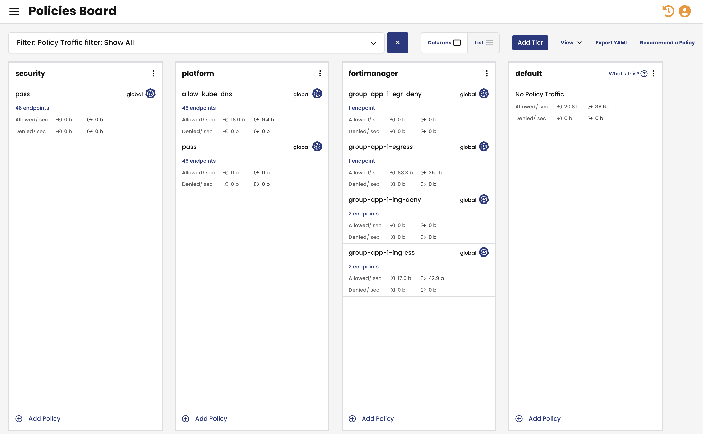

# Module 13: Running a Sample Application to validate the Calico+FortiManager Integration

**Goal:** We are now ready to verify the Calico Enterprise and FortiManager integration can be used to manage East-West policies by launching an application and configuring a policy in FortiManager to be translated to Calico policy.

## Steps

1. Under the `demo` subdirectory, there is a `app-1.yaml` deployment file. Let's take a look at the `app-1.yaml`:

    ```yaml
    kind: Namespace
    apiVersion: v1
    metadata:
      name: ns1
      labels:
        compliance: open
        env: dev
    ---
    apiVersion: v1
    kind: Pod
    metadata:
      name: centos
      namespace: ns1
      labels:
        name: centos
        app: app-1
        tigera.io/address-group: ns1-centos-address-group
    spec:
      containers:
      - name: centos
        image: centos:latest
        command: [ "/bin/bash", "-c", "--" ]
        args: [ "while true; do sleep 30; done;" ]
        resources: {}
    ---
    apiVersion: apps/v1
    kind: Deployment
    metadata:
      name: app-1
      namespace: ns1
    spec:
      selector:
        matchLabels:
          app: app-1
      replicas: 2
      template:
        metadata:
          labels:
            app: app-1
            tigera.io/address-group: app-1-address-group
        spec:
          containers:
          - name: nginx
            image: nginx
            ports:
            - containerPort: 80
            resources: {}
    ---
    apiVersion: apps/v1
    kind: Deployment
    metadata:
      name: app-2
      namespace: ns1
    spec:
      selector:
        matchLabels:
          app: app-2
      replicas: 2
      template:
        metadata:
          labels:
            app: app-2
            tigera.io/address-group: app-2-address-group
        spec:
          containers:
          - name: nginx
            image: nginx
            ports:
            - containerPort: 80
            resources: {}
    ---
    apiVersion: v1
    kind: Service
    metadata:
      name: app-1-svc
      namespace: ns1
      labels:
        service: app-1-svc
    spec:
      ports:
      - port: 80
        targetPort: 80
        protocol: TCP
      selector:
        app: app-1
    ---
    apiVersion: v1
    kind: Service
    metadata:
      name: app-2-svc
      namespace: ns1
      labels:
        service: app-2-svc
    spec:
      ports:
      - port: 80
        targetPort: 80
        protocol: TCP
      selector:
        app: app-2
    ```

    This deployment creates two sample `nginx` deployments in `ns1` called `app-1` and `app-2`, and a `centos` utility pod. Our goal here is to configure FortiManager Policy Packages to secure these two `nginx` applications using Calico Policies. You will notice that we have a label `tigera.io/address-group` that identifies which FortiManager Address Group this applications belong to. In our case the values are `app-1-address-group`, `app-2-address-group` and `ns1-centos-address-group`. Let's deploy the app:

2. You deploy them:

    ```bash
    kubectl apply -f app-1.yaml
    ```

    Verify that the  application is deployed:

    ```bash
    $ kubectl get pod -n ns1
    
    NAME                     READY   STATUS    RESTARTS   AGE
    app-1-66db7b7fb9-4kp8h   1/1     Running   1          1h
    app-1-66db7b7fb9-52rq5   1/1     Running   1          1h
    app-2-755b9959bf-djw48   1/1     Running   1          1h
    app-2-755b9959bf-gzj28   1/1     Running   1          1h
    centos                   1/1     Running   1          1h
    ```

3. In the FortiManager portal, navigate to **Policy & Objects > Object Configurations > Create New > Address Group**. We need to create empty Address Groups: `app-1-address-group`, `app-2-address-group` and `ns1-centos-address-group`. When you select Members, ensure you search for `none` and select that option.

    >Notice that Address Groups names you create in FortiManager should match the values provided for `tigera.io/address-group` label of the applications for which you want to create policies.

    

4. Repeat the process for `app-2-address-group` and `ns1-centos-address-group`.

5. Now you will create a policy under the **Policy Packages**  tab in **calico-ew** package to secure the two applications. Create a policy to allow the `centos` pod with label `tigera.io/address-group: ns1-centos-address-group` to connect over HTTP to `nginx` pods with label `tigera.io/address-group: app-1-address-group`. Click on **Create New** and fill the values as shown in the below image:

    

    Repeat this step to allow the `centos` pod to connect over HTTP and ICMP to the `nginx` pods with label `tigera.io/address-group: app-2-address-group`.

6. Now you can validate that this policy was translated by Calico Enterprise integration controller into a Calico Network Policy and was added to the `fortimanager` Tier in Calico Enterprise.

    

    You should see for policies created to secure both applications in both the Ingress and Egress direction. Explore the policy rules configured by the integration controller.

7. Test connection between the pods.

    Use IP of one of the `nginx` pods to test the connection between the `centos` pod and `nginx` applications.

    ```bash
    # get pod IP
    POD_IP=$(kubectl -n ns1 get po -l app=app-1 -ojsonpath='{.items[0].status.podIP}')
    # text HTTP connection
    kubectl -n ns1 exec -t centos -- curl $POD_IP
    ```

    However, the connection between the `nginx` pods should not be blocked as our policies do not allow it.

    ```bash
    kubectl -n ns1 exec -t $(kubectl -n ns1 get po -l app=app-2 -ojsonpath='{.items[0].metadata.name}') -- curl $POD_IP
    ```

8. Test connection using application Kubernetes service.

    a. Use Kubernetes service of one of the `nginx` applications to test the connection.

    ```bash
    kubectl -n ns1 exec -t centos -- curl app-1-svc
    ```

    This connection would not succeed if you don't have a policy allowing applications to access Kubernetes DNS component.

    b. Deploy Kubernetes DNS policy.

    ```bash
    kubectl apply -f demo/kube-dns.policy.yaml
    ```

    Test the connection again. This time it should succeed.

    >It is important to allow your applications to communicate with Kubernetes DNS service when the applications require connection over Kubernetes service.

9. Congratulations! You have successfully completed all the labs.
