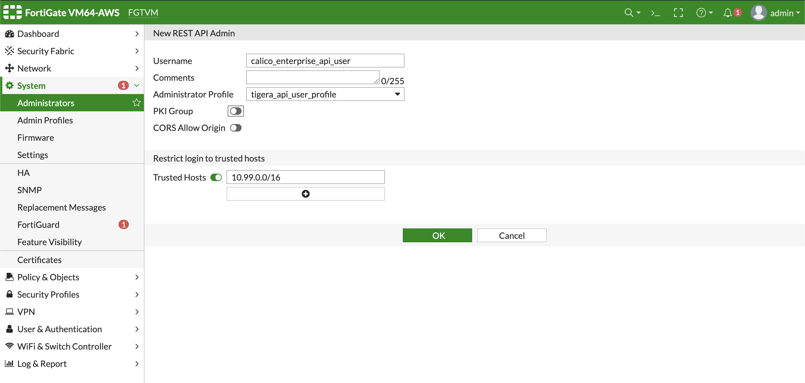

# Module 9: Integrating Calico Enterprise with FortiGate

**Goal:** Integrate Calico Enterprise with FortiGate this will enable you to use Calico Enterprise network policy to control traffic from Kubernetes clusters in your FortiGate firewalls.

### How the integration works

The Calico Enterprise integration controller (`tigera-firewall-controller`) lets you manage FortiGate firewall address group objects dynamically, based on Calico Enterprise GlobalNetworkPolicy.

You determine the Kubernetes pods that you want to allow access outside the firewall, and create Calico Enterprise global network policy using selectors that match those pods. After you deploy the tigera firewall controller in the Kubernetes cluster, you create a ConfigMap with the Fortinet firewall information. The Calico Enterprise controller reads the ConfigMap, gets FortiGate firewall IP address, API token and source IP address selection, it can be either node or pod.

In your kubernetes cluster, if pods IP addresses are routable and address selection is `pod`, then it populates the Kubernetes pod IPs of selector matching pods in FortiGate address group objects or
If source address selection is `node`, then populates the kubernetes node IPs of selector matching pods in Fortigate address group objects.

### Steps


1. **Configure FortiGate firewall to communicate with firewall controller:**

a. Determine and note the CIDR’s or IP addresses of all Kubernetes nodes that can run the `tigera-firewall-controller`. This is required to explicitly allow the `tigera-firewall-controller` to access the FortiGate API. In our case, the CIDR is `10.99.0.0/16`

b. Go to Fortigate from your browser and under **System> Admin Profiles**  tab, create a new profile called `tigera_api_user_profile` with `read-write` access to **Firewall > Addresss**. 


c. Under **Administrators** tab,  Create a **REST API Administrator** user called `calico_enterprise_api_user` and associate this user with the `tigera_api_user_profile` profile and add CIDR or IP address of your kubernetes cluster nodes as trusted hosts. Ensure that you toggle the "Trusted Hosts" section to include the `10.99.0.0/16` CIDR.



d. Note the API key.

2. **Configure FortiManager to communicate with firewall controller** 

a. Determine and note the CIDR’s or IP addresses of all Kubernetes nodes that can run the `tigera-firewall-controller`. This is required to explicitly allow the `tigera-firewall-controller` to access the FortiGate API. In our case, the CIDR is `10.99.0.0/16`

b.  Go to FortiManager from your browser, from **System Settings**, create a new  profile named `tigera_api_user_profile` with `Read-Write` access for `Policy & Objects`. 

c. Under **Administrators** tab, create a new user named `tigera_fortimanager_admin` and associate this user with the `tigera_api_user_profile` profile and add CIDR or IP address of your kubernetes cluster nodes as `Trusted Hosts`.

d. Note username (`tigera_fortimanager_admin`) and password you used. 

3. **Configure Calico Enterprise**

a. From the master node, you will configure Calico Enterprise. You need to fill in your FortiManager and FortiGate **PRIVATE IPs** from the `10.99.1.X` subnet in the `4-firewall-config.yaml` ConfigMap then apply it. 

```
kind: Namespace
apiVersion: v1
metadata:
  name: tigera-firewall-controller
---
# Configuration of Tigera Firewall Controller
kind: ConfigMap
apiVersion: v1
metadata:
  name: tigera-firewall-controller-configs
  namespace: tigera-firewall-controller
data:
  # FortiGate device information
  tigera.firewall.fortigate: |
    - name: fortigate
      ip: 10.99.1.12   ####### UPDATE with FortiGate Private IP
      apikey:
        secretKeyRef:
          name: fortigate
          key: fortigate-key
  tigera.firewall.fortimgr: |
    - name: fortimgr
      ip: 10.99.1.33   ####### UPDATE with FortiManager Private IP
      username: tigera_fortimanager_admin
      adom: root
      password:
        secretKeyRef:
          name: fortimgr
          key: fortimgr-pwd
---
apiVersion: v1
kind: ConfigMap
metadata:
  name: tigera-firewall-controller
  namespace: tigera-firewall-controller
data:
  tigera.firewall.addressSelection: node
  tigera.firewall.policy.selector: projectcalico.org/tier == 'fortinet'
```

Then you can apply it:

```
$ kubectl create -f 4-firewall-config.yaml
namespace/tigera-firewall-controller created
configmap/tigera-firewall-controller-configs created
configmap/tigera-firewall-controller created
```

4. **Create FortiGate and FortiManager API User and Key as Kubernetes Secrets.**

a. Store each FortiGate API key as Secret in `tigera-firewall-controller` namespace.
for example, In the above config map for FortiGate device `fortigate`, store its ApiKey as a secret name as `fortigate`, with key as `fortigate-key`

```
$ kubectl create secret generic fortigate \
-n tigera-firewall-controller \
--from-literal=fortigate-key=<fortigate-api-secret>
secret/fortigate created
```

b. Store FortiManager Password as Secret in `tigera-firewall-controller` namespace.
This store its password as a secret name as `fortimgr`, with key as `fortimgr-pwd`

```
$ kubectl create secret generic fortimgr \
  -n tigera-firewall-controller \
  --from-literal=fortimgr-pwd=<fortimgr-password>
```

5. Deploy firewall controller in the Kubernetes cluster

a. Install your Tigera pull secret in the new namespace we created:

```
$ kubectl create secret generic tigera-pull-secret \
--from-file=.dockerconfigjson=<path/to/pull/secret> \
--type=kubernetes.io/dockerconfigjson -n tigera-firewall-controller
secret/tigera-pull-secret created
```

b. Apply the manifest

```
kubectl apply -f https://docs.tigera.io/manifests/fortinet.yaml
```

6. Verify that the deployment of the controller is successful:

```
$ kubectl get pod  -n tigera-firewall-controller
NAME                                          READY   STATUS    RESTARTS   AGE
tigera-firewall-controller-586bb9756d-b2qfw   1/1     Running   0          19m
```


