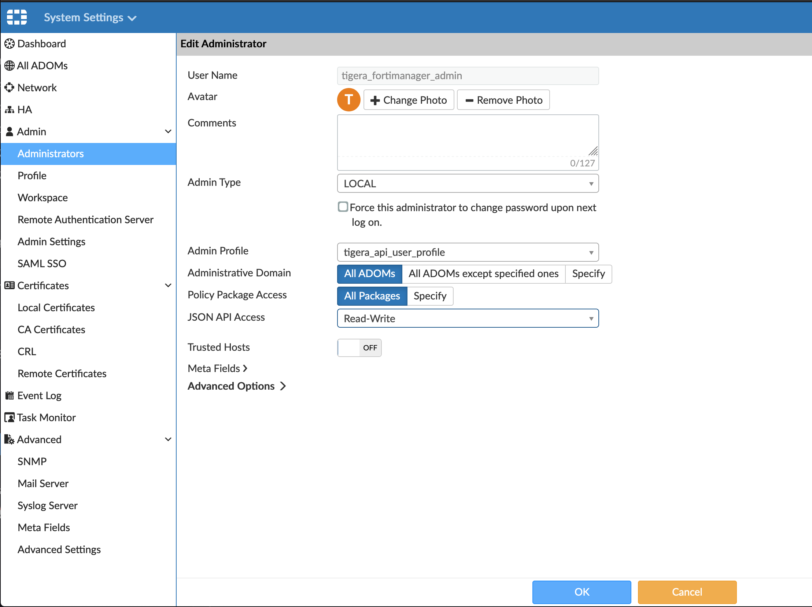

# Module 11: Integrating Calico Enterprise with FortiManager 

**Goal:**  Use FortiManager to create firewall policies that are applied as Calico Enterprise network policies on Kubernetes workloads. Use the power of a Calico Enterprise “higher-order tier” so Kubernetes policy is evaluated early in the policy processing order, but update policy using FortiManager UI. Use the Calico Enterprise Manager UI as a secondary interface to verify the integration and troubleshoot using logs.

### How the integration works

This Calico Enterprise/Fortinet solution lets you directly control Kubernetes policies using FortiManager.

The basic workflow is:

- Determine the Kubernetes pods that you want to securely communicate with each other.
- Label these pods using a key-value pair where key is the `tigera.io/address-group`, and value is the pod matching a label name.
- In the FortiManager, select the cluster’s ADOM, and create an address group using the key-value pair associated with the pods.
- Create firewall policies using the address groups for IPv4 Source address and IPv4 Destination Address, and select services and actions as you normally would to allow or deny the traffic. Under the covers, the Calico Enterprise integration controller periodically reads the FortiManager firewall policies for your Kubernetes cluster, converts them to Calico Enterprise global network policies, and applies them to clusters.
- Use the Calico Enterprise Manager UI to verify the integration, and then FortiManager UI to make all updates to policy rules.


### Steps

1. **Configure FortiManager to communicate with firewall controller** 

a. Determine and note the CIDR’s or IP addresses of all Kubernetes nodes that can run the `tigera-firewall-controller`. This is required to explicitly allow the `tigera-firewall-controller` to access the FortiGate API. In our case, the CIDR is `10.99.0.0/16`

b.  Go to FortiManager from your browser, from **System Settings**, create a new  profile named `tigera_api_user_profile` with `Read-Write` access for `Policy & Objects`. 

c. Under **Administrators** tab, create a new user named `tigera_fortimanager_admin` and associate this user with the `tigera_api_user_profile` profile and make sure that you enable **All Packages** and **Read-Write** for the JSON API Access.



d. Note username (`tigera_fortimanager_admin`) and password you used. 

2. **Configure Calico Enterprise**

a. From the master node, you will configure Calico Enterprise. You need to fill in your FortiManager  **PRIVATE IPs** from the `10.99.1.X` subnet in the `5-fortimanager-firewall-config.yaml` ConfigMap then apply it. 

```
# Configuration of Tigera Fortimanager Integration Controller
kind: ConfigMap
apiVersion: v1
metadata:
  name: tigera-fortimanager-controller-configs
  namespace: tigera-firewall-controller
data:
  tigera.firewall.fortimanager-policies: |
    - name: fortimgr
      ip: 10.99.1.33   ####### UPDATE with FortiManager Private IP
      username: tigera_fortimanager_admin
      adom: root
      packagename: default
      tier: fortimanager
      password:
        secretKeyRef:
          name: fortimgr
          key: fortimgr-pwd
```

Then you can apply it:

```
$ kubectl create -f 5-fortimanager-firewall-config.yaml
```

4. **Create FortiManager API User and Key as Kubernetes Secrets.**


a. Store FortiManager Password as Secret in `tigera-firewall-controller` namespace.
This store its password as a secret name as `fortimgr`, with key as `fortimgr-pwd`

```
$ kubectl create secret generic fortimgr \
  -n tigera-firewall-controller \
  --from-literal=fortimgr-pwd=<fortimgr-password>
```

5. Deploy firewall controller in the Kubernetes cluster


a. Apply the manifest

```
kubectl apply -f https://docs.tigera.io/manifests/fortimanager.yaml
```

6. Verify that the deployment of the controller is successful:

```
$ kubectl get pod  -n tigera-firewall-controller
NAME                                                              READY   STATUS    RESTARTS   AGE
tigera-firewall-controller-58847b76b-m6b5m                        1/1     Running   0          14m
tigera-firewall-controller-fortimanager-policies-ccc4f6f879j8f7   1/1     Running   0          32m
```


