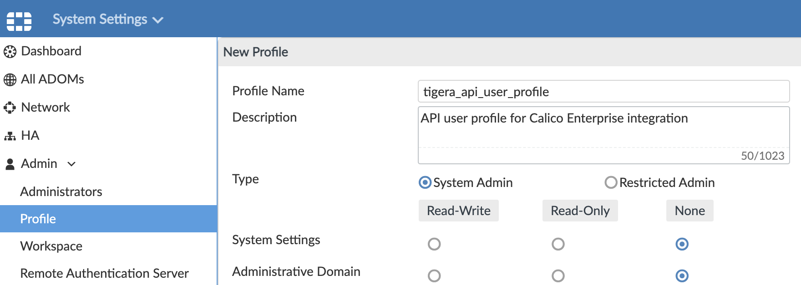
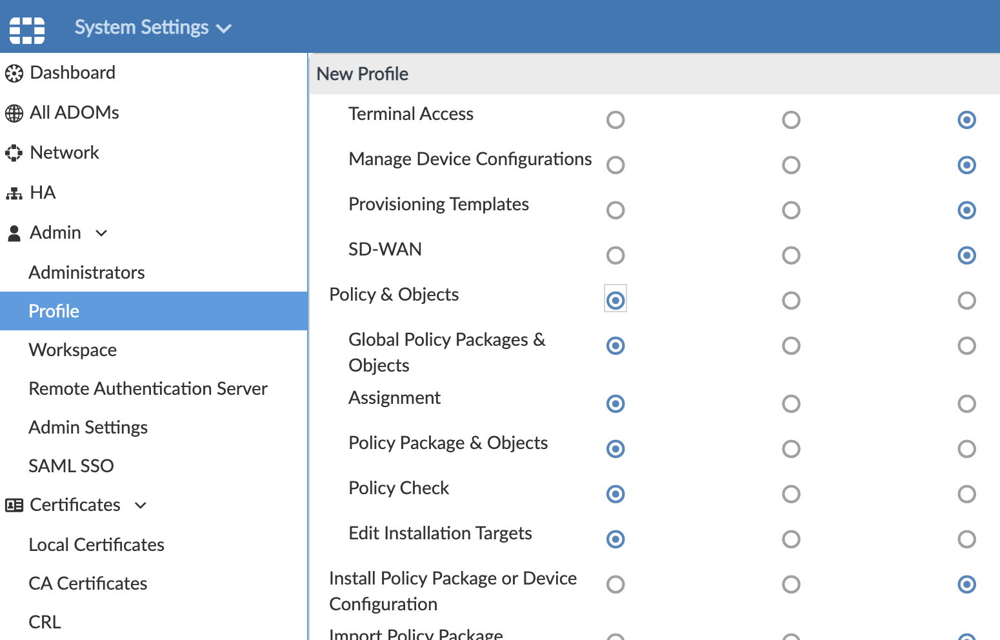
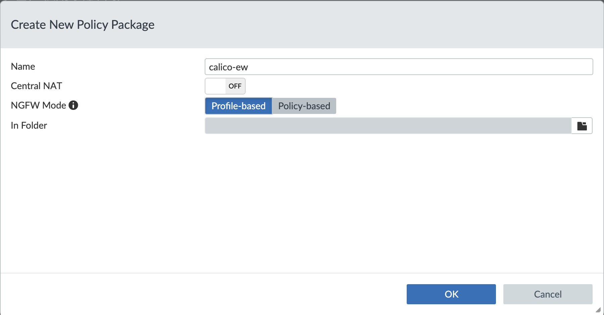
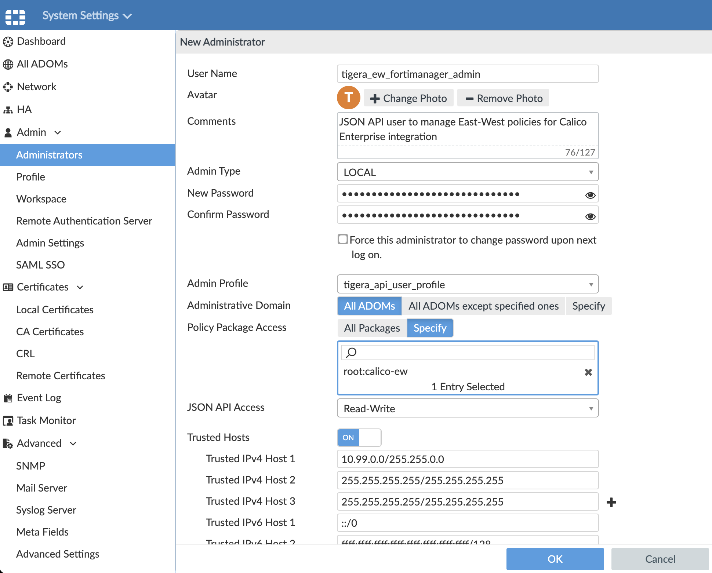

# Module 12: Integrating Calico Enterprise with FortiManager for East-West policy management

**Goal:**  Use FortiManager to create firewall policies that are applied as Calico Enterprise network policies on Kubernetes workloads, i.e East-West policy management. Use the power of a Calico Enterprise “higher-order tier” so Kubernetes policy is evaluated early in the policy processing order, but update policy using FortiManager UI. Use the Calico Enterprise Manager UI as a secondary interface to verify the integration and troubleshoot using logs.

## How the integration works

This Calico Enterprise/Fortinet solution lets you directly control Kubernetes policies using FortiManager.

>If you use FortiManager to manage both North-South and East-West policies for Calico enabled Kubernetes cluster, make sure to use a dedicated FortiManager package for each type of policies. For that, set appropriate `packagename` in the East-West integration configuration YAML.

The basic workflow is:

- Determine the Kubernetes pods that you want to securely communicate with each other.
- Label these pods using a key-value pair where key is the `tigera.io/address-group`, and value is the pod matching a label name.
- In the FortiManager, select the cluster’s ADOM, and create an address group using the key-value pair associated with the pods.
- Create firewall policies using the address groups for IPv4 Source address and IPv4 Destination Address, and select services and actions as you normally would to allow or deny the traffic. Under the covers, the Calico Enterprise integration controller periodically reads the FortiManager firewall policies for your Kubernetes cluster, converts them to Calico Enterprise global network policies, and applies them to clusters.
- Use the Calico Enterprise Manager UI to verify the integration, and then FortiManager UI to make all updates to policy rules.

## Steps

1. **Configure FortiManager to communicate with firewall controller**

    From your browser, log into FortiManager UI Console using the public IP and port `443` provided to you in the output of the `terraform apply` step.

    >If you already have a suitable API user profile, you can use it to create `tigera_ew_fortimanager_admin` and skip steps `a` and `b`.

    a. Determine and note the CIDR’s or IP addresses of all Kubernetes nodes that can run the `tigera-firewall-controller`. This is required to explicitly allow the `tigera-firewall-controller` to access the FortiGate API. In our case, the CIDR is `10.99.0.0/16`

    b. Go to FortiManager from your browser, from **System Settings** -> **Admin** -> **Profile**, create a new  profile named `tigera_api_user_profile` with `Read-Write` access for `Policy & Objects`.

    

    

    c. Create a policy package that will be dedicated to managing East-West policies. Navigate to **Policy & Objects** -> **Policy Packages** and create a new package `calico-ew`.

    

    d. Under **System Settings** -> **Admin** -> **Administrators** tab, create a new user named `tigera_ew_fortimanager_admin` and associate this user with the `tigera_api_user_profile` profile. Make sure that you enable **All Packages** and **Read-Write** for the JSON API Access. Specify CIDR or IP addresses of Kubernetes hosts in the `Trusted Hosts` field. In our case, it is `10.99.0.0/16`.

    

    e. Note username (`tigera_ew_fortimanager_admin`) and password you used.

2. **Configure Calico Enterprise**

    From the master node, you will configure Calico Enterprise. You need to fill in your FortiManager  **PRIVATE IP** from the `10.99.1.X` subnet in the `5-fortimanager-firewall-config.yaml` ConfigMap then apply it. Note the `packagename` setting that should specify the name of FortiManager package where you will manage East-West policies for your Kubernetes applications. In our case it's `calico-ew` package name.

    ```yaml
    # Configuration of Tigera Fortimanager Integration Controller
    kind: ConfigMap
    apiVersion: v1
    metadata:
      name: tigera-fortimanager-controller-configs
      namespace: tigera-firewall-controller
    data:
      tigera.firewall.fortimanager-policies: |
        - name: fortimgr
          ip: 10.99.1.X   ####### UPDATE with FortiManager Private IP
          username: tigera_ew_fortimanager_admin
          adom: root
          packagename: calico-ew
          tier: fortimanager
          password:
            secretKeyRef:
              name: fortimgr-ew
              key: fortimgr-pwd
    ```

    Then you can apply it:

    ```bash
    # create namespace
    kubectl create namespace tigera-firewall-controller
    # create fortimanager controller configmap
    FMGR_IP='<FortiManager_Private_IP>'
    sed -e "s/10.99.1.X/$FMGR_IP/1" 5-fortimanager-firewall-config.yaml | kubectl create -f-
    ```

3. **Create FortiManager API User and Key as Kubernetes Secrets.**

    Configure `tigera_ew_fortimanager_admin` user password as a `Secret` in `tigera-firewall-controller` namespace.
    The password is stored as a Kubernetes `Secret` resource with name `fortimgr-ew`, and key `fortimgr-pwd`.

    ```bash
    kubectl create secret generic fortimgr-ew \
      -n tigera-firewall-controller \
      --from-literal=fortimgr-pwd=<fortimgr-password>
    ```

4. **Deploy firewall controller in the Kubernetes cluster.**

    a. Download Fortinet integration manifest

    ```bash
    curl -O https://downloads.tigera.io/ee/v3.15.3/manifests/fortimanager.yaml
    ```

    b. Review the manifest and adjust if needed

    >If you use FortiManager integration for East-West policy management together with Fortinet integration for North-South policy management, some of the resource names may overlap and could result in misconfiguraiton. Make sure the resource names for East-West integraiton differ from those for North-South configuration.

    ```bash
    # if East-South integration resources have the same names as North-South integration, rename them to avoid any configuration collisions
    sed -i '/\s*namespace:\stigera-firewall-controller/b; s/tigera-firewall-controller/tigera-firewall-controller-ew/g' fortimanager.yaml
    ```

    c. Apply the manifest

    ```bash
    # if tigera-pull-secret does not exist in the tigera-firewall-controller namespace
    # create Tigera pull secret in FortiManager controller namespace
    kubectl create secret generic tigera-pull-secret --type=kubernetes.io/dockerconfigjson -n tigera-firewall-controller --from-file=.dockerconfigjson=dockerjsonconfig.json

    # deploy FortiManager controller manifest
    kubectl apply -f fortimanager.yaml
    ```

5. **Verify that the deployment of the controller is successful.**

    ```bash
    $ kubectl get pod  -n tigera-firewall-controller

    NAME                                                                 READY   STATUS    RESTARTS   AGE
    tigera-firewall-controller-58847b76b-m6b5m                           1/1     Running   0          14m
    tigera-firewall-controller-ew-fortimanager-policies-ccc4f6f879j8f7   1/1     Running   0          1m
    ```

[Module 9 :arrow_left:](../modules/deploy-app-0.md) &nbsp;&nbsp;&nbsp;&nbsp;[:arrow_right: Module 13](../modules/deploy-app-1.md)

[:leftwards_arrow_with_hook: Back to Main](/README.md)
